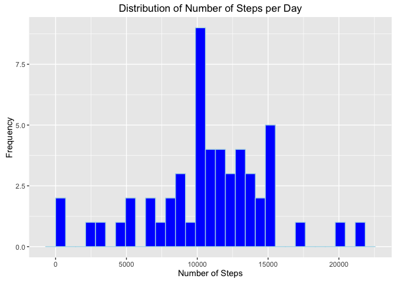
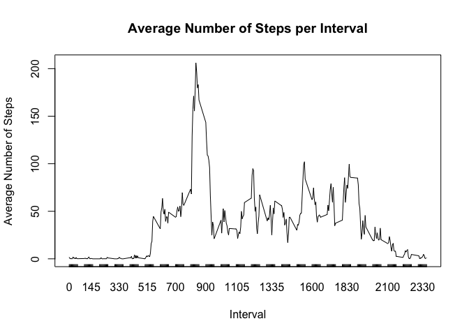
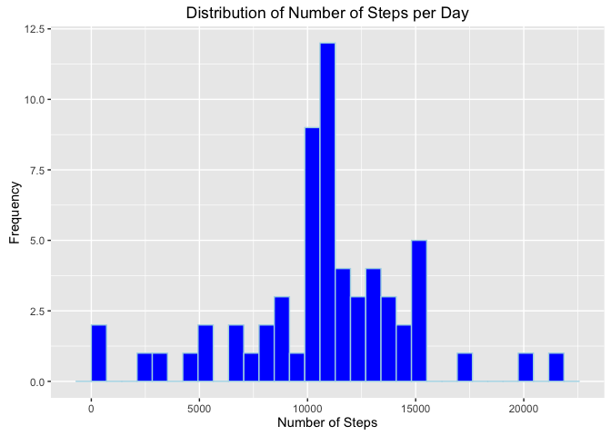
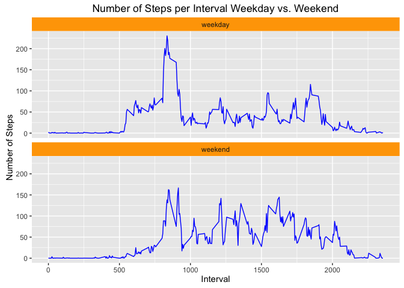

# Reproducible Research: Peer Assessment 1


## Loading and preprocessing the data

```r
data <- read.csv("../data/activity.csv")
data$date <- as.Date(as.character(data$date, "%Y-%m-%d"))
```

## What is mean total number of steps taken per day?

####**Grouping/Summarizing Number of Stpes by Date**

```r
library(dplyr)
num_steps_per_day <- data %>%
    group_by(date) %>%
    summarise(total_num_steps = sum(steps))
```

####**Plotting Histogram**

```r
library(ggplot2)
qplot(num_steps_per_day$total_num_steps, 
      geom="histogram",
      fill=I("blue"),
      col=I("lightblue"),
      main="Distribution of Number of Steps per Day",
      xlab="Number of Steps",
      ylab="Frequency")
```




####**Calculating Mean and Median Number of Stpes per Day**

```r
mean <- mean(num_steps_per_day$total_num_steps, na.rm=T)
median <- median(num_steps_per_day$total_num_steps, na.rm=T)
```

```
## Mean total number of steps per day:
```

```
## 10766.19
```

```
## Median total number of steps per day:
```

```
## 10765
```

## What is the average daily activity pattern?

####**Grouping/Summarizing Number of Steps by Interval**

```r
library(dplyr)
num_steps_per_interval <- data %>%
    group_by(interval) %>%
    summarise(average_num_steps = mean(steps, na.rm=T))
```

####**Plotting Time-Series Line Graph**


```r
with(num_steps_per_interval, 
     plot(x=interval, 
          y=average_num_steps, 
          type="l",
          main="Average Number of Steps per Interval",
          xlab="Interval",
          ylab="Average Number of Steps",
          xaxt="n")
     )
axis(1, at=num_steps_per_interval$interval, tck=0.01)
```



```
## quartz_off_screen 
##                 3
```

####**Identifying Interval with Max Average Number of Steps**

```r
max = max(num_steps_per_interval$average_num_steps)
max_average_interval <- 
    num_steps_per_interval[num_steps_per_interval$average_num_steps == max, ]$interval
```

```
## Interval containing max average steps:
```

```
## 835
```

## Imputing missing values

####**Calculating Total Number of NAs**

```r
is_na <- is.na(data)
num_na_rows <- sum(is_na)
```

```
## Total number of missing values:
```

```
## 2304
```

####**Creating New Dataset with NAs Imputed**

```r
## impute NAs with average values for corresponding interval
imputed_data <- data
for (i in 1:dim(imputed_data)[1]) {
    if (is.na(imputed_data[i, ])) {
        interval <- imputed_data[i, ]$interval
        idx <- which(num_steps_per_interval$interval == interval)
        imputed_data[i, ]$steps <- num_steps_per_interval[idx, ]$average_num_steps
    }
}
```

####**Grouping/Summarizing Number of Steps by Date**

```r
library(dplyr)
imputed_num_steps_per_day <- imputed_data %>%
    group_by(date) %>%
    summarise(total_num_steps = sum(steps))
```

####**Plotting Histogram**

```r
library(ggplot2)
qplot(imputed_num_steps_per_day$total_num_steps, 
      geom="histogram",
      fill=I("blue"),
      col=I("lightblue"),
      main="Distribution of Number of Steps per Day",
      xlab="Number of Steps",
      ylab="Frequency")
```


      
####**Calculating Mean and Median Number of Steps per Day**

```r
mean <- mean(imputed_num_steps_per_day$total_num_steps, na.rm=T)
median <- median(imputed_num_steps_per_day$total_num_steps, na.rm=T)
```

```
## Mean total number of steps per day:
```

```
## 10766.19
```

```
## Median total number of steps per day:
```

```
## 10766.19
```

## Are there differences in activity patterns between weekdays and weekends?

####**Adding Weekday/Weekend Factor Variable**

```r
library(dplyr)
imputed_data <- imputed_data %>%
    mutate(dayofweek = weekdays(date)) %>%
    mutate(daytype = 
               ifelse(dayofweek=="Saturday" | dayofweek=="Sunday", 
                      "weekend", "weekday")) %>%
    mutate(daytype = factor(daytype, levels=c("weekday","weekend")))
```

####**Averaging Number of Steps, Weekday vs. Weekend**

```r
library(dplyr)
weekday_num_steps_per_interval <- imputed_data %>%
    filter(daytype == "weekday") %>%
    group_by(interval) %>%
    summarise(daytype = "weekday",
              average_num_steps = mean(steps))

weekend_num_steps_per_interval <- imputed_data %>%
    filter(daytype == "weekend") %>%
    group_by(interval) %>%
    summarise(daytype = "weekend",
              average_num_steps = mean(steps))

merged <- rbind(weekday_num_steps_per_interval, weekend_num_steps_per_interval)
```

####**Plotting Faceted Time-Series Line Graph**

```r
library(ggplot2)
ggplot(merged, 
       aes(x=interval, y=average_num_steps)) + 
    geom_line(col="blue") + 
    facet_wrap(~daytype, ncol=1) +
    theme(strip.background = element_rect(fill="orange")) +
    ggtitle("Number of Steps per Interval Weekday vs. Weekend") +
    labs(x="Interval", y="Number of Steps") 
```


